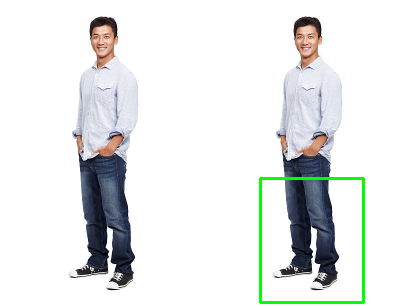

Simple haar cascade detection model for lower body. Try the code and let me know if you get lucky :P.

5 Sample images are given and tested, in case it doesn't work try to change this statement:

```body_full = lower_body_cascade.detectMultiScale(gray, scale_factor=1.1,iterations= 3)```

Either scale factor or iteration value, more the iterations, higher the accuracy but it could create false negatives at the same time. Here are the results of above tested images:


Sample Image-1


Sample Image-2


Sample Image-3



Sample Image-4


Sample Image-5
